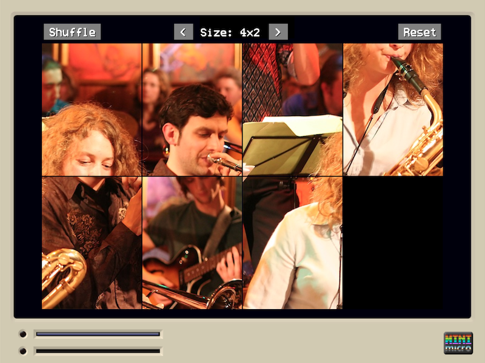
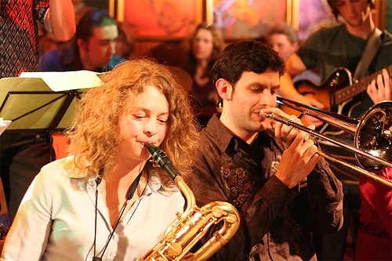
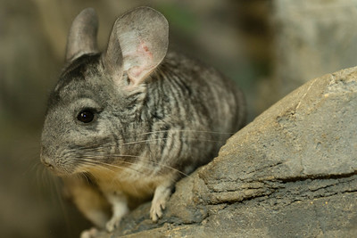

# Sliding Puzzle

[Sliding Puzzle](http://en.wikipedia.org/wiki/Sliding_puzzle) for the Mini Micro [**Mini Micro**](https://miniscript.org/).

## Credits

### About the "musicians" picture

The musicians you see on the picture are part of a Jazz "[Big Band](http://en.wikipedia.org/wiki/Big_band)".

> Tini Thomsen and Matthias Konrad 
> with the Thomsen Group @ Birdland, Hamburg

I wanted to use this picture for this puzzle because it portraits two of my favourite jazz-instruments: 

* **baritone sax** (left)
* **trombone** (right)

Original [picture](http://www.flickr.com/photos/mawel/2322324186/) taken by [Marc Wellekötter](http://www.flickr.com/photos/mawel/)

### About the "chinchilla" picture

The chinchilla picture is included because it's the official "mascot" of the MiniScript language (used in MiniMicro). I wanted to offer something MiniScript-related in this implementation.

It can be activated by modifying the source-code and pointing to it.

As stated in the wiki, the "chinchilla was selected for the mascot" because, like MiniScript:

* they're small and adorable;
* they're well-behaved;
* they're not yet widely known, but
* those who know them, love them.

Original [picture](https://www.flickr.com/photos/nationalzoo/15850856717) by the [Smithsonian's National Zoo](https://www.flickr.com/photos/nationalzoo/)

License: [Attribution-NonCommercial-NoDerivs 2.0 Generic (CC BY-NC-ND 2.0)](https://creativecommons.org/licenses/by-nc-nd/2.0/)
